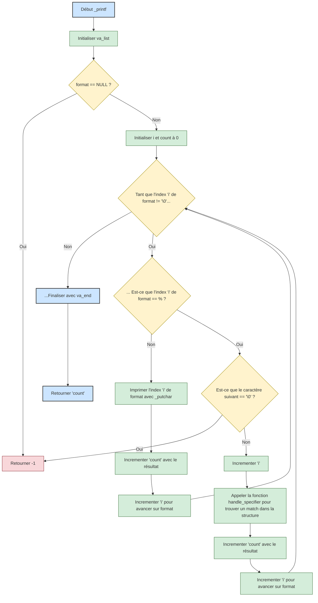

# 🖨️ Projet : \_printf

## 👩‍💻👨‍💻 Auteurs

- Claire Castan https://github.com/Helvlaska
- Kevin Fresne https://github.com/GuarickGit

---

## 📖 Sommaire

1. Introduction
2. Objectif du projet
3. Flowchart
4. Arborescence du projet
5. Compilation / Man page
6. Exemples et sorties
7. Liste des fonctions
8. Contraintes
9. Journal de bord
10. Sources / Références

---

## 1️⃣ Introduction

Ce projet s’inscrit dans le cadre de la formation Holberton et a pour objectif de reproduire la fonction `printf` en langage C. Il s'agit d’un exercice exigeant, qui nous pousse à structurer notre code, travailler en équipe et respecter des contraintes de normes strictes (notamment la norme Betty). Nous avons choisi de développer ce projet en collaboration en suivant un flowchart détaillé, une méthodologie étape par étape, et un travail de validation rigoureux à chaque étape. Cette documentation vise à présenter notre organisation, notre logique de développement, ainsi que les choix techniques effectués tout au long du projet.

## 2️⃣ Objectif du projet

- Reproduire la fonction `printf`.
- Gérer différents specifiers (`c`, `s`, `%`, `d`, `i`, `b`, `u`, `o`, `x`, `X`).
- Respecter les normes Betty.
- Créer un code lisible, structuré et évolutif.

## 3️⃣ Flowchart



## 4️⃣ Arborescence du projet

```
/holbertonschool-printf
│
├── man_3_printf
├── main.h
├── main.c
├── _printf.c
├── _putchar.c
├── specifiers.c
├── specifiers_advanced.c
├── specifiers_advanced_hexa.c
└── README.md
```

## 5️⃣ Compilation / Man page

```bash
gcc -Wall -Werror -Wextra -pedantic -std=gnu89 -Wno-format main.h *.c
```
```bash
man ./man_3_printf
```
## 6️⃣ Exemple & Sortie

### Exemple
```bash
#include "main.h"
int main()
{
    _printf("String: [%s]\n", "Hello Axel, thank you for the 100% !");
    _printf("Decimal: [%d]\n", 190892);
    return(0);
}
```

### Sortie

```bash
String: [Hello Axel, thank you for the 100% !]
Decimal: [190892]
```

## 7️⃣ Liste des fonctions

| Fichier               | Fonction             | Rôle                                                     |
| --------------------- | -------------------- | -------------------------------------------------------- |
| _printf.c             | specifiers_list      | Retourne un tableau de specifiers avec leurs fonctions   |
| _printf.c             | print_unknown_char   | Gère les caractères non reconnus après `%`               |
| _printf.c             | match_specifier      | Gère la recherche et l'appel dans la structure           |
| _printf.c             | _printf              | Fonction principale, lecture et dispatch                 |
| specifiers.c          | print_char           | Affiche un caractère                                     |
| specifiers.c          | print_string         | Affiche une chaîne de caractères                         |
| specifiers.c          | print_percent        | Affiche un `%` littéral                                  |
| specifiers.c          | print_integer        | Affiche un entier ou une décimale                        |
| specifiers_advanced.c | print_binary         | Affiche la représentation binaire d’un unsigned int      |
| specifiers_advanced.c | print_unsigned       | Affiche un entier non signé en base 10                   |
| specifiers_advanced.c | print_octal          | Affiche un entier non signé en base 8 (octal)            |
| specifiers_advanced_hexa.c| print_hexa      | Affiche un entier non signé en hexadécimal               |
| specifiers_advanced_hexa.c| print_hexa_lower     | Affiche un entier non signé en hexadécimal (en minuscule)|
| specifiers_advanced_hexa.c| print_hexa_upper     | Affiche un entier non signé en hexadécimal (en majuscule)|

## 8️⃣ Contraintes

- Respecter la norme Betty (40 lignes max / fonction).
- Pas d’utilisation de fonctions interdites.
- Gestion propre des erreurs.
- Retourner le nombre de caractères écrits.

## 9️⃣ Journal de bord

| Date / Étape | Décision / Action prise | Impact / Validation |
| ------------ | ----------------------- | ------------------- |
| Jour 1 | Brainstorming sur la façon de procéder | Base de réflexion commune posée |
|        | Ébauche d'un flowchart | Visualisation claire du projet |
|        | Création du repository GitHub (HolbertonSchool_printf) | Environnement de travail prêt |
|        | Création des branches de travail (main, Kevin, Claire) | Organisation du travail structurée |
|        | Création d'un fichier main.h avec la structure et les prototypes | Support commun pour tous les fichiers |
|        | Création d'un fichier specifiers.c | Centralisation des fonctions specifiers |
|        | Création du fichier _printf.c | Mise en place de la fonction principale |
|        | Ajout d'un README.md vide | Prêt à documenter au fil du projet |
| Jour 2 | Refactorisation de _printf | Code plus propre et lisible |
|        | Validation de la gestion des specifiers %c, %s, %% | ✅ Validé à 100% par le checker |
|        | Mise en place d'un squelette pour le README | Structure de documentation en place |
| Jour 3 | Validation de la gestion des specifiers %d et %i | ✅ Validé à 100% par le checker |
|        | Création du flowchart avec Mermaid | Support visuel ✅ validé en équipe |
|        | Ajout et complétion du README | Documentation claire et à jour |
| Jour 4 | Validation de la gestion du specifier %b | ✅ Validé à 100% par le checker |
|        | Création de la man page | Support ✅ validé en équipe  |
|        | Ajout et complétion du README | Documentation claire et à jour |
| Jour 5 | Validation de la gestion des specifiers %u, %o, %x, %X | ✅ Validé à 100% par le checker |
|        | Ajout et complétion du README | Documentation claire et à jour |
|        | Préparation à l'entretien de groupe | En cours  |


## 🔟🔗 Sources / Références

- Documentation man de `printf`
- Cours Holberton
- Exercices Holberton
- Discussions entre binômes
- ChatGPT

---
